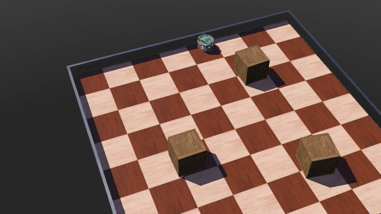
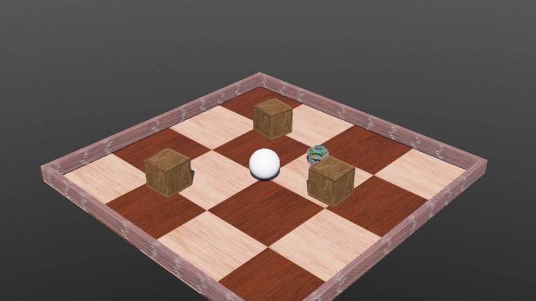
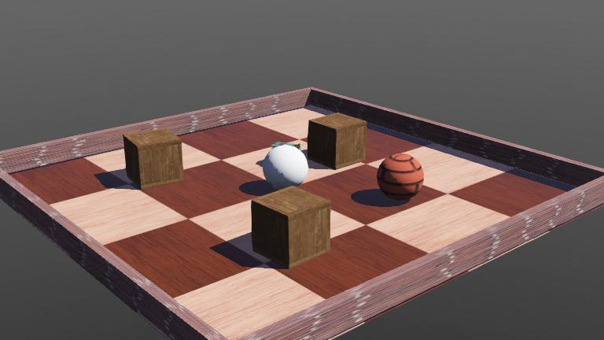
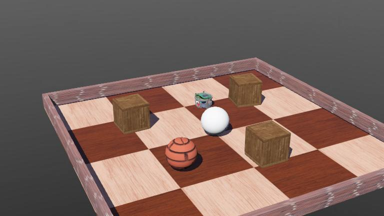
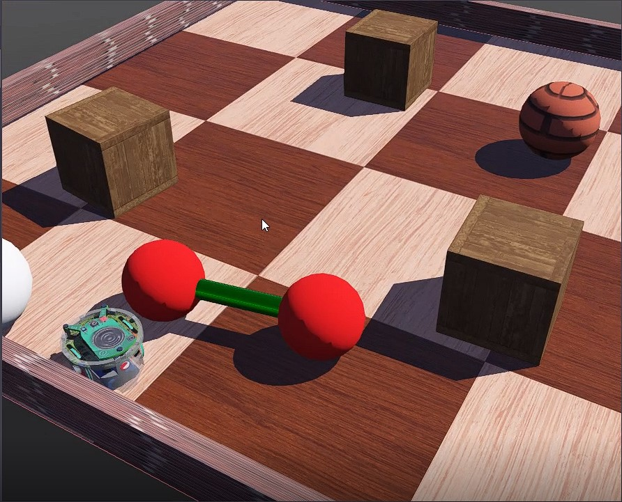
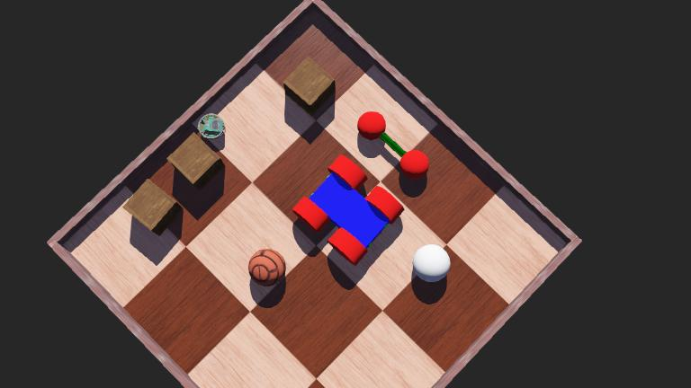
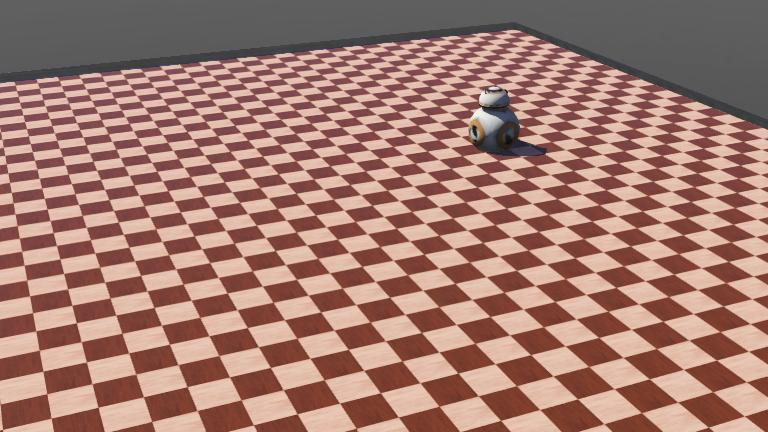

<h1 align="center">WEBOTS TUTORIAL</h1>
<h3 align="center"> oleh Mohammad Rayhan Aryana - 1103194042</h3>

  

## ||Webots||

 Webots adalah software simulasi yang kuat untuk robot mobile, drone, dan kendaraan otomatis. Dikembangkan oleh Cyberbotics, ini menawarkan mesin fisika yang berkualitas tinggi dan lingkungan 3D yang realistis untuk mensimulasikan perilaku robot dalam berbagai kondisi. Ini memiliki beragam sensor, aktuator, dan kontroler yang dapat digunakan untuk memodelkan dan menguji kinerja robot dalam berbagai skenario. Ini juga menawarkan antarmuka yang mudah digunakan, yang memungkinkan pengguna untuk memrogram dan mengontrol gerakan dan perilaku robot. Webots juga mencakup lingkungan pengembangan yang dibangun untuk membuat dan mengedit kontroler, serta mesin fisika untuk simulasi yang realistis. Telah banyak digunakan dalam akademia dan industri untuk menguji dan mengevaluasi kinerja robot, serta untuk pelatihan dan pendidikan di bidang robotika dan sistem otomatis. 

## ||TUTORIAL||
### Tutorial 1

Pada tutorial 1 ini adalah langkah pertama kita untuk mencoba simulasi robot pada aplikasi webots. Untuk lebih detail silahkan simak [video](https://drive.google.com/file/d/1rpDHphARn-PJs7L2p-O8WhMkEF_bj2Xl/view?usp=share_link) berikut.

### Tutorial 2

Pada tutorial 2 ini adalah langkah selanjutnya dari tutorial 1, yaitu menambahkan objek baru pada simulasi webots. detailnya ada pada  [video](https://drive.google.com/file/d/1CeknyKX7h846-fSv6CGGreeMF0pSgqoI/view?usp=share_link) berikut.

### Tutorial 3

Pada tutorial 3 ini adalah langkah selanjutnya dari tutorial 2, yaitu memodifikasi appearance pada objek dengan menambahkan motif tertentu. detailnya ada pada  [video](https://drive.google.com/file/d/1wrYHR0iL7-zRhZVd8kgANgTAsCCpOV8n/view?usp=share_link) berikut.

### Tutorial 4

Pada tutorial 4 ini adalah langkah selanjutnya dari tutorial 3, yaitu menambahkan controller baru yang digunakan untuk robot e-puck. detailnya ada pada  [video](https://drive.google.com/file/d/1_fZDomgHQbBIe-Nbt1IhU9-WlucJH6hu/view?usp=share_link) berikut.

### Tutorial 5

Pada tutorial 5 ini adalah langkah selanjutnya dari tutorial 4, yaitu membuat objek dumble. detailnya ada pada  [video](https://drive.google.com/file/d/1LOFefJZocSt8gRSV1sXY_J-sEpp_InCU/view?usp=share_link) berikut.

### Tutorial 6

Pada tutorial 6 ini adalah langkah selanjutnya dari tutorial 5, yaitu membuat objek mobil yang disertai sensor jarak dan menambahkan controller pada mobil. detailnya ada pada  [video](https://drive.google.com/file/d/136ySIm7SC3iW6fHrKqeydQ4Zob1ekG9S/view?usp=share_link) berikut.

### Tutorial 7

Pada tutorial 7 ini adalah langkah selanjutnya dari tutorial 6, yaitu Kita akan membuat proto file dari objek yang sudah dibuat sebelumnya, lalu menambahkan nya kedalam world project. detailnya ada pada  [video](https://drive.google.com/file/d/1iUeyBzCFATbqeVbP4csNqrR9nNKppgFG/view?usp=share_link) berikut.

### Tutorial 8

Pada tutorial 8 ini adalah langkah selanjutnya dari tutorial 7, yaitu membat supervisor untuk menggerakkan robot e-puck. detailnya ada pada  [video](https://drive.google.com/file/d/1V65ZynpoiyqwcIPgChhxE-YhAvj74f2X/view?usp=share_link) berikut.

### Tutorial 9

Pada tutorial 9 ini adalah langkah selanjutnya dari tutorial 8, yaitu mengintegrasikan ROS2 dengan webots. detailnya ada pada  [video](https://drive.google.com/file/d/1nnLvOX4FKm46k9ZE6wSOsLJ4T_DKh0D6/view?usp=share_link) berikut.

## ||Lampiran||
- Untuk keseluruhan video handson tutorial webots dapat dilihat pada [link](https://drive.google.com/drive/folders/1WM1xqk4LSIQ5sRmZVbcmGTCjSrJrNtKh?usp=share_link) berikut.
